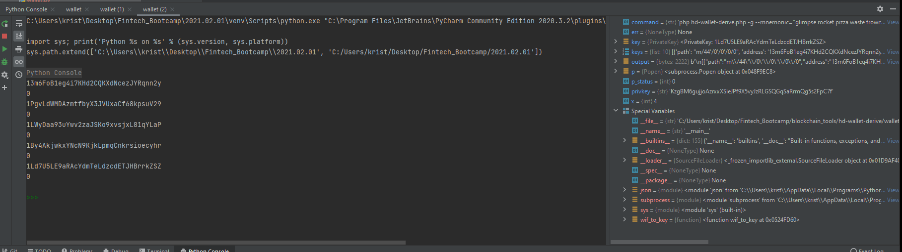

# Unit_19_Homework
Imported BTC testnet coin using faucets to two addresses. 

Ran into multiple errors in attempting to create codes listed in homework but not found in the bit library. 
Class lessons did not appropriately discuss to level of sophistication required for this homework, as previous homework had many run errors I did not understand how to fully execute this one. 

Running the code in anaconda prompt errored out at library imports. 

However checking install proved the library was installed:

running in Pycharm resulted in this output: 
